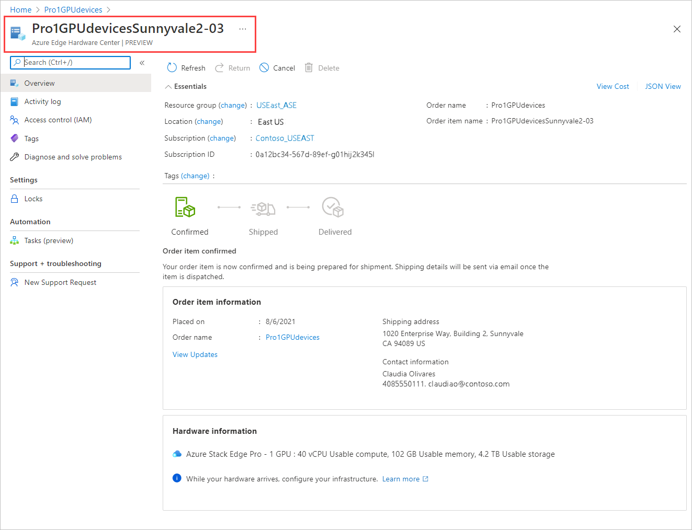

Azure Edge Hardware Center를 통해 주문하려면 다음 단계를 수행합니다.

1. Microsoft Azure 자격 증명을 사용하여 [https://portal.azure.com](https://portal.azure.com) URL에서 Azure Portal에 로그인합니다.

2. **+ 리소스 만들기** 를 선택합니다. **Azure Edge Hardware Center** 를 검색하여 선택합니다. Azure Edge Hardware Center에서 **만들기** 를 선택합니다.

    ![Azure Stack Edge Hardware Center 홈페이지의 스크린샷. [만들기] 단추가 강조 표시되어 있습니다.](media/azure-edge-hardware-center-new-order/edge-hardware-center-new-resource-01.png)

3. 구독을 선택하고 **다음** 을 선택합니다.

    ![Azure Edge Hardware Center 주문에 대한 "구독 선택" 옵션의 스크린샷. [구독] 옵션 및 [다음] 단추가 강조 표시되어 있습니다.](media/azure-edge-hardware-center-new-order/edge-hardware-center-new-resource-02.png)

4. 주문을 시작하려면 주문하려는 제품군(예: **Azure Stack Edge**) 옆에 있는 **주문** 을 선택합니다. 제품군이 보이지 않으면 다른 구독을 사용해야 할 수도 있습니다. **다른 구독을 선택하세요** 를 선택합니다. 

    ![Azure Edge Hardware Center에서 주문할 제품군을 선택하는 스크린샷. 제품군의 [주문] 단추가 강조 표시되어 있습니다.](media/azure-edge-hardware-center-new-order/edge-hardware-center-new-resource-03.png) 

5. 주문의 배송지를 선택합니다.

    ![Azure Edge Hardware Center 주문의 배송지를 선택하는 스크린샷. 배송지 옵션 및 [다음] 단추가 강조 표시되어 있습니다.](media/azure-edge-hardware-center-new-order/edge-hardware-center-new-resource-04.png)

6. **하드웨어 선택** 페이지에서 **선택** 단추를 사용하여 주문할 하드웨어 제품을 선택합니다. 예를 들어 **Azure Stack Edge Pro - GPU** 를 선택합니다. 

    ![Azure Edge Hardware Center 주문의 하드웨어 제품을 선택하는 스크린샷 제품의 [선택] 단추가 강조 표시되어 있습니다.](media/azure-edge-hardware-center-new-order/edge-hardware-center-new-resource-05.png)

    하드웨어 제품을 선택한 후에는 주문할 디바이스 구성을 선택합니다. 다음 하드웨어 제품 및 디바이스 구성은 Azure Edge Hardware Center(미리 보기)에서 확인할 수 있습니다.

    |하드웨어 제품              |구성                                                                                              |
    |------------------------------|------------------------------------------------------------------------------------------------------------|
    |Azure Stack Edge Pro - GPU    |<ul><li>Azure Stack Edge Pro - 1 GPU</li><li>Azure Stack Edge Pro - 2 GPU</li><ul>                          |
    |Azure Stack Edge Pro R        |<ul><li>Azure Stack Edge Pro R - 단일 노드</li><li>Azure Stack Edge Pro R - UPS가 포함된 단일 노드</li></ul>|
    |Azure Stack Edge Mini R       |한 가지 구성. 자동으로 선택됩니다.                 |

7. 디바이스 구성을 선택한 다음, **선택** 을 선택합니다. 아래 화면에는 Azure Stack Edge Pro - GPU 디바이스에서 선택 가능한 구성이 나와 있습니다.

    모두 동일한 구성을 갖는 Azure Stack Edge Mini R 디바이스를 주문하는 경우 이 화면이 표시되지 않습니다. 

    

    **주문 만들기** 마법사가 열립니다.

8.  **기본 사항** 탭에서 **주문 이름**, **리소스 그룹** 및 **Azure 지역** 값을 입력합니다. **다음: 배송 + 수량 >** 을 선택합니다.

    
  
    다음으로, 디바이스를 보낼 각 배송 주소를 추가하고 각 주소로 보낼 디바이스 수를 지정합니다. 주문당 최대 20개의 장치(디바이스)를 주문할 수 있습니다.

9. **배송 + 수량** 탭에서 디바이스를 보낼 각 배송 주소를 추가합니다. 

    - 새 배송 주소를 추가하려면 **새 주소 추가** 를 선택합니다. 

       **새 주소** 화면의 필수 **주소 별칭** 필드는 나중에 사용할 수 있도록 주소를 식별합니다. 주소 필드에 정보를 모두 입력했으면 **추가** 를 클릭합니다. **주소 선택** 을 사용하여 주문에 주소를 추가합니다.

       ![Azure Edge Hardware Center 주문에 대한 [새 주소] 화면의 스크린샷. 주소 별칭 옵션과 [추가] 단추가 강조 표시되어 있습니다.](media/azure-edge-hardware-center-new-order/edge-hardware-center-new-resource-08.png)

    - 이전 주문의 배송 주소를 사용하거나, 방금 추가한 주소를 사용하려면 **주소 선택** 을 선택합니다. 그런 다음, **주소 선택** 화면에서 하나 이상의 주소를 선택하고 **선택** 을 선택합니다.

       ![Azure Edge Hardware Center 주문에 대한 [주소 선택] 화면의 스크린샷. "주소 선택" 옵션에서 선택한 주소 2개와 [선택] 단추가 강조 표시되어 있습니다.](media/azure-edge-hardware-center-new-order/edge-hardware-center-new-resource-09.png)

    이제 **배송 + 수량** 탭에는 각 배송 주소에 대한 별도의 품목이 있습니다.

    각 주문 품목 이름에는 해당 주소로 배송되는 각 디바이스의 품목 번호와 함께 이름 접두사(주문 이름 + 주소 별칭)가 포함됩니다.

    ![2개의 주소가 있는 Azure Edge Hardware Center 주문의 [배송 + 수량] 탭 화면. 주문 품목 이름의 일부가 식별되었습니다.](media/azure-edge-hardware-center-new-order/edge-hardware-center-new-resource-10.png)

10. 각 주소의 **배송 + 수량** 탭에서 배송할 디바이스 **수량** 을 입력합니다.

    입력하는 수량이 1개보다 많으면 주문 품목 이름 뒤에 **+n개 추가** 레이블이 표시됩니다.

     ![주소의 수량이 1개보다 많은 [배송 + 수량] 탭을 보여주는 스크린샷](media/azure-edge-hardware-center-new-order/edge-hardware-center-new-resource-11.png)

11. 주문 품목의 이름을 변경하려면 주문 품목 이름을 선택하고 클릭하여 **주문 품목 이름 바꾸기** 창을 엽니다. 한 주소에 품목을 여러 개 배송하는 경우 **+n개 추가** 를 선택합니다.

    다음과 같은 두 가지 유형의 이름 변경이 가능합니다.
 
    * 모든 주문 품목에 다른 이름 접두사를 사용하려면 다음 화면에 표시된 것처럼 **이름 접두사** 를 편집한 다음, **적용** 을 선택합니다.

    * 각 주문 품목의 이름을 개별적으로 편집할 수도 있습니다. 

    모두 마쳤으면 **완료** 를 선택합니다.

    

    **다음: 알림 >** 을 선택하여 계속합니다.

12. 주문 진행 상황에 대한 상태 알림을 받으려면 **알림** 탭에서 각 수신자의 이메일 주소를 입력합니다. 

    이메일 주소를 추가하려면 주소를 입력하고 **추가** 를 선택합니다. 최대 20개의 이메일 주소를 추가할 수 있습니다.

    ![Azure Edge Hardware Center 주문에 대한 [알림] 탭의 스크린샷. [알림] 탭, [추가] 단추 및 [검토 + 만들기] 단추가 강조 표시되었습니다.](media/azure-edge-hardware-center-new-order/edge-hardware-center-new-resource-13.png)

    모두 마쳤으면 **검토 + 만들기** 를 선택하여 계속합니다.

13. **리뷰 + 만들기** 탭에서 다음을 수행합니다.

    1. 주문을 검토합니다. 이 화면을 열면 주문의 유효성이 자동으로 검사됩니다. **유효성 검사 실패** 배너가 표시되는 경우 문제를 해결한 후 주문을 작성해야 합니다.
    
    1. **개인정보처리방침** 을 검토하고 사용 약관에 동의하는 확인란을 선택합니다.
 
    1. **만들기** 를 선택합니다.

    ![Azure Edge Hardware Center 주문에 대한 [검토 + 만들기] 탭의 스크린샷](media/azure-edge-hardware-center-new-order/edge-hardware-center-new-resource-14.png)

    제품이 배포되는 동안 포털에서 주문이 열리고, 각 주문 품목의 상태가 표시됩니다. 배포가 완료된 후에는 **배포 세부 정보** 옆에 있는 아래쪽 화살표를 클릭하여 개별 품목의 상태를 확인해야 할 수도 있습니다.

    ![Azure Edge Hardware Center 주문이 배포되는 동안 [배포 세부 정보]를 보여주는 스크린샷. [리소스] 세부 정보가 강조 표시되어 있습니다.](media/azure-edge-hardware-center-new-order/edge-hardware-center-new-resource-15.png)

14. 아래와 같이 주문 품목의 세부 정보를 보려면 [배포 세부 정보]의 **리소스** 열에서 품목을 선택합니다.

    

15. 디바이스가 배송된 후에는(**배송됨** 태그가 녹색) **하드웨어 구성** 옵션이 품목 세부 정보에 추가됩니다. Azure Stack Edge의 디바이스에 대한 관리 리소스를 만들려면 이 옵션을 선택합니다.    

    ![Azure Edge Hardware Center에서 배송된 주문 품목의 [하드웨어 구성] 옵션을 보여주는 스크린샷](media/azure-edge-hardware-center-new-order/edge-hardware-center-new-resource-17.png)<!--Requested from Anam: Screenshot of an Azure Edge Hardware Center resource with Shipped status, with the Configure hardware option displayed. Graphical display of tags.-->

    구독, 리소스 그룹 및 배포 영역에는 주문 정보가 입력되지만, 직접 변경할 수도 있습니다.

    ![Azure Edge Hardware Center 주문의 배송된 주문 품목에 대한 [관리 리소스 만들기] 화면을 보여주는 스크린샷](media/azure-edge-hardware-center-new-order/edge-hardware-center-new-resource-18.png)

    디바이스를 활성화한 후에는 품목에서 관리 리소스를 열고, 관리 리소스에서 주문 품목을 열 수 있습니다.<!--Detailed procedure to be provided in an article on managing Hardware Center orders.-->
