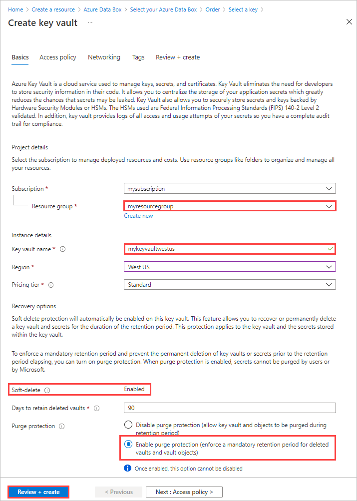

디바이스를 주문하려면 Azure Portal에서 다음 단계를 수행합니다.

1. Microsoft Azure 자격 증명을 사용하여 다음 URL에서 로그인합니다. [https://portal.azure.com](https://portal.azure.com)
2. **+ 리소스 만들기** 를 선택하고 *Azure Data Box* 를 검색합니다. **Azure Data Box** 를 선택합니다.

   

3. **만들기** 를 선택합니다.  

   

4. 해당 지역에서 Data Box 서비스를 사용할 수 있는지 확인합니다. 다음 정보를 입력하거나 선택한 다음, **적용** 을 선택합니다.

    |설정  |값  |
    |---------|---------|
    |전송 형식     | **Azure로 가져오기** 를 선택합니다.        |
    |Subscription     | Data Box 서비스에 대한 EA, CSP 또는 Azure 스폰서쉽 구독을 선택합니다.   구독은 대금 청구 계정에 연결됩니다.       |
    |Resource group | 기존 리소스 그룹을 선택합니다. 리소스 그룹은 함께 관리하거나 배포할 수 있는 리소스에 대한 논리 컨테이너입니다. |
    |원본 국가/지역    |    현재 데이터가 있는 국가/지역을 선택합니다.         |
    |대상 Azure 지역     |     데이터를 전송하려는 Azure 지역을 선택합니다.   자세한 내용은 [Data Box 지역 가용성](../articles/databox/data-box-overview.md#region-availability) 또는 [Data Box Heavy 지역 가용성](../articles/databox/data-box-heavy-overview.md#region-availability)을 참조하세요.  |

    

5. 아래와 같이 Data Box 또는 Data Box Heavy 중에서 주문할 **Data Box** 제품을 선택합니다. 

    

    Data Box의 경우 단일 주문의 최대 사용 가능한 용량은 80TB입니다. Data Box Heavy의 경우 단일 주문의 최대 사용 가능한 용량은 770TB입니다. 더 큰 데이터 크기에 대해 여러 개의 주문을 만들 수 있습니다.

    **Data Box Heavy** 를 선택하면 Data Box 팀이 해당 지역의 디바이스 가용성을 검사합니다. 주문을 계속 진행할 수 있는 경우 사용자에게 알려줍니다.

6. **주문** 에서 **기본 사항** 탭으로 이동합니다. 다음 정보를 입력하거나 선택합니다. 그런 다음, **다음: 데이터 대상>** 을 선택합니다.

    |설정  |값  |
    |---------|---------|
    |Subscription      | 이전에 선택한 내용에 따라 구독이 자동으로 채워집니다.|
    |Resource group    | 이전에 선택한 리소스 그룹입니다. |
    |주문 이름 가져오기 | 주문을 추적하는 데 친숙한 이름을 입력합니다. <ul><li>이름은 문자, 숫자 또는 하이픈일 수 있는 3~24자일 수 있습니다.</li><li>이름은 문자 또는 숫자로 시작하고 끝나야 합니다.</li></ul>    |

    

7. **데이터 대상** 화면에서 **데이터 대상**(스토리지 계정 또는 관리 디스크)을 선택합니다.

    스토리지 대상으로 **스토리지 계정** 을 사용하는 경우 다음 화면이 표시됩니다.

    

    지정된 Azure 지역에 따라 필터링된 기존 스토리지 계정 목록에서 하나 이상의 스토리지 계정을 선택합니다. Data Box는 최대 10개의 스토리지 계정과 연결할 수 있습니다. 새 **범용 v1**, **범용 v2** 또는 **Blob Storage 계정** 도 만들 수 있습니다.

   > [!NOTE]
   > - Azure Premium FileStorage 계정을 선택하면 스토리지 계정 공유의 프로비저닝된 할당량이 파일 공유에 복사되는 데이터의 크기에 따라 증가합니다. 예를 들어 어떤 이유로 Data Box에서 데이터를 복사할 수 없는 경우 할당량이 증가된 후에는 다시 조정되지 않습니다.
   > - 이 할당량은 요금 청구에 사용됩니다. 데이터가 데이터 센터에 업로드된 후에는 요구 사항에 맞게 할당량을 조정해야 합니다. 자세한 내용은 [요금 청구 이해](../articles/storage/files/understanding-billing.md)를 참조하세요.

    가상 네트워크를 사용하는 스토리지 계정은 지원됩니다. Data Box 서비스에서 보안 스토리지 계정을 사용하려면 스토리지 계정 네트워크 방화벽 설정 내에서 신뢰할 수 있는 서비스를 사용하도록 설정합니다. 자세한 내용은 [Azure Data Box를 신뢰할 수 있는 서비스로 추가](../articles/storage/common/storage-network-security.md#exceptions)하는 방법을 참조하세요.

    Data Box를 사용하여 온-프레미스 VHD(가상 하드 디스크)에서 **관리 디스크** 를 만드는 경우에도 다음 정보를 제공해야 합니다.

    |설정  |값  |
    |---------|---------|
    |리소스 그룹     | 온-프레미스 VHD에서 관리형 디스크를 만들려는 경우 새 리소스 그룹을 만듭니다. 이전에 Data Box 서비스를 통해 관리 디스크에 대한 Data Box 주문을 만들 때 리소스 그룹을 만든 경우에만 기존 리소스 그룹을 사용할 수 있습니다.   세미콜론으로 구분해서 여러 리소스 그룹을 지정합니다. 최대 10개의 리소스 그룹이 지원됩니다.|

    

    관리형 디스크에 대해 지정한 스토리지 계정은 스테이징 스토리지 계정으로 사용됩니다. Data Box 서비스는 VHD를 관리형 디스크로 변환한 후 리소스 그룹으로 이동하기 전에 페이지 Blob으로 스테이징 스토리지 계정에 업로드합니다. 자세한 내용은 [Azure에 대한 데이터 업로드 확인](../articles/databox/data-box-deploy-picked-up.md#verify-data-upload-to-azure)을 참조하세요.

   > [!NOTE]
   > 페이지 Blob이 관리 디스크로 성공적으로 변환되지 않은 경우 스토리지 계정에 유지되고 스토리지에 대한 요금이 청구됩니다.

8. **다음: 보안>** 을 선택하여 계속합니다.

    **보안** 화면을 사용하면 사용자 고유의 암호화 키 및 디바이스를 사용하고, 암호를 공유하며, 이중 암호화를 사용하도록 선택할 수 있습니다.

    **보안** 화면의 모든 설정은 선택 사항입니다. 설정을 변경하지 않으면 기본 설정이 적용됩니다.

    

9. 사용자 고유의 고객 관리형 키를 사용하여 새 리소스에 대한 잠금 해제 암호를 보호하려면 **암호화 유형** 을 펼칩니다.

    Azure Data Box에 대한 고객 관리형 키 구성은 선택 사항입니다. 기본적으로 Data Box는 Microsoft 관리형 키를 사용하여 잠금 해제 암호를 보호합니다.

    고객 관리형 키는 디바이스의 데이터가 암호화되는 방식에 영향을 주지 않습니다. 키는 디바이스 잠금 해제 암호를 암호화하는 데만 사용됩니다.

    고객 관리형 키를 사용하지 않으려면 15단계로 건너뜁니다.

   

10. 고객 관리형 키를 사용하려면 **고객 관리형 키** 를 키 유형으로 선택합니다. 그런 다음, **키 자격 증명 모음 및 키 선택** 을 선택합니다.
   
    

11. **Azure Key Vault에서 키 선택** 블레이드에서,

    - **구독** 이 자동으로 채워집니다.

    - **키 자격 증명 모음** 의 드롭다운 목록에서 기존 키 자격 증명 모음을 선택할 수 있습니다.

      

      또는 새 키 자격 증명 모음을 만들려면 **새 키 자격 증명 모음 만들기** 를 선택합니다. 
    
            

      그런 다음, **키 자격 증명 모음 만들기** 화면에서 리소스 그룹과 키 자격 증명 모음 이름을 입력합니다. **일시 삭제** 및 **보호 제거** 를 사용하도록 설정되어 있는지 확인합니다. 다른 모든 기본값을 적용하고, **검토 + 만들기** 를 선택합니다.

      

      키 자격 증명 모음에 대한 정보를 검토하고, **만들기** 를 선택합니다. 키 자격 증명 모음 만들기가 완료될 때까지 몇 분 정도 기다립니다.

      

12. **키 선택** 블레이드에 선택한 키 자격 증명 모음이 표시됩니다.

    

    새 키를 만들려면 **새 키 만들기** 를 선택합니다. RSA 키를 사용해야 합니다. 크기는 2048 이상일 수 있습니다. 새 키에 대한 이름을 입력하고, 다른 기본값을 적용한 다음, **만들기** 를 선택합니다.

      

      키가 키 자격 증명 모음에 만들어지면 알림이 표시됩니다. 새 키가 선택되고 **키 선택** 블레이드에 표시됩니다.

13. 사용할 키의 **버전** 을 선택한 다음, **선택** 을 선택합니다.

      

    새 키 버전을 만들려면 **새 버전 만들기** 를 선택합니다.

    

    새 키 버전에 대한 설정을 선택하고,**만들기** 를 선택합니다.

    

    **보안** 화면의 **암호화 유형** 설정에 키 자격 증명 모음 및 키가 표시됩니다.

    

14. 이 리소스에 대한 액세스를 관리하는 데 사용할 사용자 ID를 선택합니다. **사용자 ID 선택** 을 선택합니다. 오른쪽 패널에서 사용할 구독 및 관리 ID를 선택합니다. 그런 다음, **선택** 을 선택합니다.

    사용자가 할당한 관리 ID는 여러 리소스를 관리하는 데 사용할 수 있는 독립 실행형 Azure 리소스입니다. 자세한 내용은 [관리 ID 유형](../articles/active-directory/managed-identities-azure-resources/overview.md)을 참조하세요.  

    새 관리 ID를 만들어야 하는 경우 [Azure Portal을 사용하여 사용자가 할당한 관리 ID에 역할 만들기, 나열, 삭제 또는 할당](../articles/active-directory/managed-identities-azure-resources/how-to-manage-ua-identity-portal.md)의 지침을 따릅니다.
    
    

    사용자 ID는 **암호화 유형** 설정에 표시됩니다.

    

15. Azure Data Box에서 기본적으로 사용하는 시스템 생성 암호를 사용하지 않으려면 **보안** 화면에서 **사용자 고유 암호 가져오기** 를 펼칩니다.

    시스템 생성 암호는 안전하며, 조직에서 달리 요구하는 경우가 아니면 사용하는 것이 좋습니다.

     

   - 사용자 고유 암호를 새 디바이스에 사용하려면 **디바이스 암호에 대한 기본 설정 지정** 에서 **사용자 고유 암호 사용** 을 선택하고 보안 요구 사항을 충족하는 암호를 입력합니다.
     
     암호는 영숫자여야 하며 최소한 대문자 1개, 소문자 1개, 특수 문자 1개, 숫자 1개로 구성된 12~15자여야 합니다.

     - 허용되는 특수 문자: @ # - $ % ^ ! + = ; : _ ( )
     - 허용되지 않는 문자: I i L o O 0
   
     

 - 사용자 고유 암호를 공유에 사용하려면 다음을 수행합니다.

   1. **공유 암호에 대한 기본 설정 지정** 에서 **사용자 고유 암호 사용** 및 **공유 암호 선택** 을 선택합니다.
     
       

    1. 각 스토리지 계정에 대한 암호를 순서대로 입력합니다. 암호가 스토리지 계정에 대한 모든 공유에서 사용됩니다.
    
       암호는 영숫자여야 하며 최소한 대문자 1개, 소문자 1개, 특수 문자 1개, 숫자 1개로 구성된 12~64자여야 합니다.

       - 허용되는 특수 문자: @ # - $ % ^ ! + = ; : _ ( )
       - 허용되지 않는 문자: I i L o O 0
     
    1. 동일한 암호를 모든 스토리지 계정에 사용하려면 **모두에 복사** 를 선택합니다. 

    1. 완료되면 **저장** 을 선택합니다.
     
       

    **보안** 화면에서 **암호 보기 또는 변경** 을 사용하여 암호를 변경할 수 있습니다.

16. 소프트웨어 기반 이중 암호화를 사용하도록 설정하려면 **보안** 에서 **이중 암호화(매우 안전한 환경용)** 를 펼치고 **주문에 이중 암호화 사용** 을 선택합니다.

    

    소프트웨어 기반 암호화는 Data Box에 있는 데이터의 AES-256비트 암호화와 함께 수행됩니다.

    > [!NOTE]
    > 이 옵션을 사용하도록 설정하면 주문 처리 및 데이터 복사 시간이 더 길어질 수 있습니다. 주문을 만든 후에는 이 옵션을 변경할 수 없습니다.

    **다음: 연락처 세부 정보>** 를 선택하여 계속합니다.

17. **연락처 세부 정보** 에서 **+ 주소 추가** 를 선택합니다.

    

18. **주소 추가** 화면에서 사용자의 성과 이름, 회사의 이름과 우편 주소 및 유효한 전화 번호를 제공합니다. **주소 확인** 을 선택합니다. 서비스에서 서비스 가용성에 대한 주소의 유효성을 검사하고 서비스를 해당 주소에 사용할 수 있는지 알려줍니다.

    

    주문이 성공적으로 발주된 후 자체 관리형 배송을 선택하면 이메일 알림을 받게 됩니다. 자체 관리형 배송에 대한 자세한 내용은 [자체 관리형 배송 사용](../articles/databox/data-box-portal-customer-managed-shipping.md)을 참조하세요.

19. 배송 정보가 성공적으로 확인되면 **배송 주소 추가** 을 선택합니다. **연락처 정보** 탭으로 이동됩니다.

20. **이메일** 옆에 하나 이상의 이메일 주소를 추가합니다. 서비스에서는 주문 상태에 대한 모든 업데이트와 관련된 이메일 알림을 지정한 이메일 주소로 보냅니다.

    그룹의 관리자가 떠나는 경우에도 계속 알림을 받으려면 그룹 이메일을 사용하는 것이 좋습니다.

    

21. **검토 + 주문** 에서 주문, 연락처, 알림 및 개인 정보 사용 약관과 관련된 정보를 검토합니다. 개인 정보 처리 방침에 대한 계약에 해당하는 확인란을 선택합니다.

22. **주문** 을 선택합니다. 주문을 만드는 데 몇 분 정도 걸립니다.

    