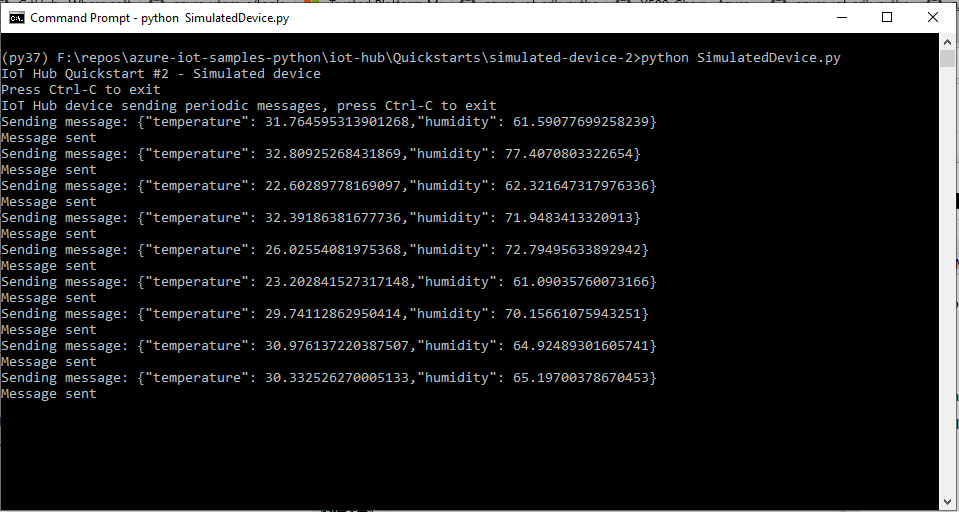
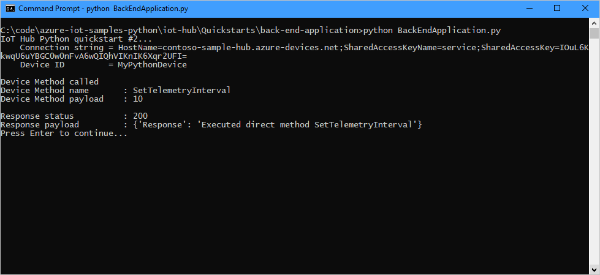
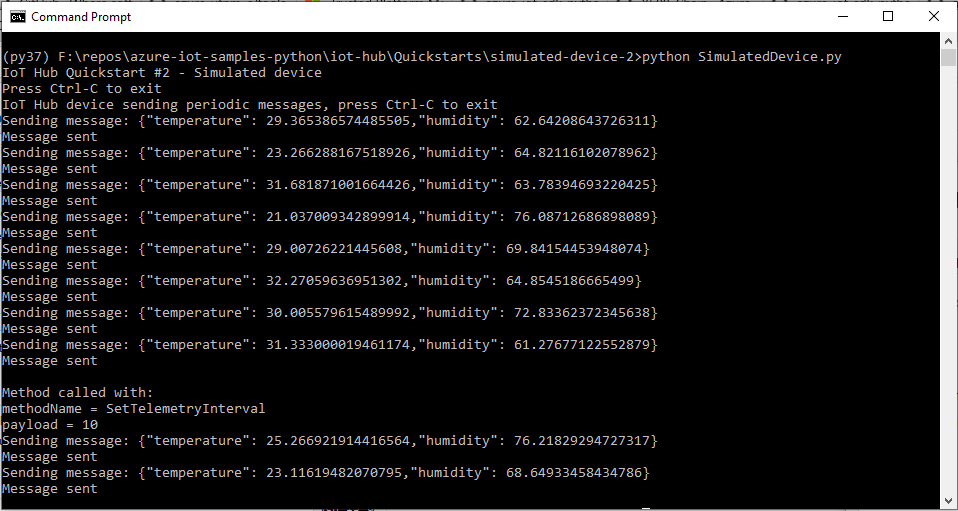

 이 빠른 시작에서는 백 엔드 애플리케이션에서 호출된 직접 메서드에 응답하는 시뮬레이션된 디바이스 애플리케이션과 시뮬레이션된 디바이스에서 직접 메서드를 호출하는 백 엔드 애플리케이션인 두 개의 Python 애플리케이션을 사용합니다.

## <a name="prerequisites"></a>사전 요구 사항

* 활성 구독이 있는 Azure 계정. [체험 계정 만들기](https://azure.microsoft.com/free/?ref=microsoft.com&utm_source=microsoft.com&utm_medium=docs&utm_campaign=visualstudio)

* [Python 3.7 이상](https://www.python.org/downloads/). 지원되는 다른 버전의 Python은 [Azure IoT 디바이스 기능](https://github.com/Azure/azure-iot-sdk-python/tree/main/azure-iot-device#azure-iot-device-features)을 참조하세요.

* github의 [샘플 Python 프로젝트](https://github.com/Azure-Samples/azure-iot-samples-python/). github 리포지토리에 있는 **코드** 단추를 사용하여 샘플을 다운로드하거나 복제합니다.

* 방화벽에서 포트 8883이 열려 있습니다. 이 빠른 시작의 디바이스 샘플은 포트 8883을 통해 통신하는 MQTT 프로토콜을 사용합니다. 이 포트는 일부 회사 및 교육용 네트워크 환경에서 차단될 수 있습니다. 이 문제를 해결하는 자세한 내용과 방법은 [IoT Hub에 연결(MQTT)](../articles/iot-hub/iot-hub-mqtt-support.md#connecting-to-iot-hub)을 참조하세요.

[!INCLUDE [azure-cli-prepare-your-environment.md](azure-cli-prepare-your-environment-no-header.md)]

[!INCLUDE [iot-hub-cli-version-info](iot-hub-cli-version-info.md)]

## <a name="create-an-iot-hub"></a>IoT Hub 만들기

이전 [빠른 시작: 원격 분석을 디바이스에서 IoT 허브로 전송](../articles/iot-develop/quickstart-send-telemetry-iot-hub.md?pivots=programming-language-python)을 완료한 경우 이 단계를 건너뛸 수 있습니다.

[!INCLUDE [iot-hub-include-create-hub](iot-hub-include-create-hub.md)]

## <a name="register-a-device"></a>디바이스 등록

이전 [빠른 시작: 원격 분석을 디바이스에서 IoT 허브로 전송](../articles/iot-develop/quickstart-send-telemetry-iot-hub.md?pivots=programming-language-python)을 완료한 경우 이 단계를 건너뛸 수 있습니다.

연결을 위해 디바이스를 IoT Hub에 등록해야 합니다. 이 빠른 시작에서는 Azure Cloud Shell을 사용하여 시뮬레이션된 디바이스를 등록합니다.

1. Azure Cloud Shell에서 다음 명령을 실행하여 디바이스 ID를 만듭니다.

    **YourIoTHubName**: 이 자리 표시자를 IoT 허브용으로 선택한 이름으로 바꿉니다.

    **MyPythonDevice**: 등록 중인 디바이스의 이름입니다. 표시된 대로 **MyPythonDevice** 를 사용하는 것이 좋습니다. 다른 디바이스 이름을 선택하는 경우 이 문서 전체에서도 해당 이름을 사용해야 하며, 샘플 애플리케이션에서 디바이스 이름을 업데이트한 후 실행해야 합니다.

    ```azurecli-interactive
    az iot hub device-identity create --hub-name {YourIoTHubName} --device-id MyPythonDevice
    ```

2. Azure Cloud Shell에서 다음 명령을 실행하여 방금 등록한 디바이스의 _디바이스 연결 문자열_ 을 가져옵니다.

    **YourIoTHubName**: 이 자리 표시자를 IoT 허브용으로 선택한 이름으로 바꿉니다.

    ```azurecli-interactive
    az iot hub device-identity connection-string show --hub-name {YourIoTHubName} --device-id MyPythonDevice --output table
    ```

    다음과 같은 디바이스 연결 문자열을 기록해 둡니다.

   `HostName={YourIoTHubName}.azure-devices.net;DeviceId=MyNodeDevice;SharedAccessKey={YourSharedAccessKey}`

    이 값은 빠른 시작의 뒷부분에서 사용합니다.

3. 또한 백 엔드 애플리케이션을 IoT 허브에 연결하여 메시지를 검색할 수 있게 하려면 _서비스 연결 문자열_ 이 필요합니다. 다음 명령은 IoT Hub에 대한 서비스 연결 문자열을 검색합니다.

    **YourIoTHubName**: 이 자리 표시자를 IoT 허브용으로 선택한 이름으로 바꿉니다.

    ```azurecli-interactive
    az iot hub connection-string show \
      --policy-name service \
      --hub-name {YourIoTHubName} \
      --output table
    ```

    다음과 같은 서비스 연결 문자열을 기록해 둡니다.

   `HostName={YourIoTHubName}.azure-devices.net;SharedAccessKeyName=service;SharedAccessKey={YourSharedAccessKey}`

    이 값은 빠른 시작의 뒷부분에서 사용합니다. 서비스 연결 문자열은 이전 단계에서 기록한 디바이스 연결 문자열과 다릅니다.

## <a name="listen-for-direct-method-calls"></a>직접 메서드 호출 수신 대기

시뮬레이션된 디바이스 애플리케이션은 IoT 허브의 디바이스별 엔드포인트에 연결하고, 시뮬레이션된 원격 분석을 전송하고, 허브에서 직접 메서드 호출을 수신 대기합니다. 이 빠른 시작에서 허브의 직접 메서드 호출은 디바이스에 원격 분석을 보내는 간격을 변경하도록 지시합니다. 시뮬레이션된 디바이스는 직접 메서드를 실행한 후 승인을 다시 허브로 보냅니다.

1. 로컬 터미널 창에서 Python 프로젝트 샘플의 루트 폴더로 이동합니다. 그런 다음, **iot-hub\Quickstarts\simulated-device-2** 폴더로 이동합니다.

1. 원하는 텍스트 편집기에서 **SimulatedDevice.py** 파일을 엽니다.

    `CONNECTION_STRING` 변수의 값을 이전에 기록해 둔 디바이스 연결 문자열로 바꿉니다. 그런 다음, 변경 내용을 **SimulatedDevice.py** 에 저장합니다.

1. 로컬 터미널 창에서 다음 명령을 실행하여 시뮬레이션된 디바이스 애플리케이션에 필요한 라이브러리를 설치합니다.

    ```cmd/sh
    pip install azure-iot-device
    ```

1. 로컬 터미널 창에서 다음 명령을 실행하여 시뮬레이션된 디바이스 애플리케이션을 실행합니다.

    ```cmd/sh
    python SimulatedDevice.py
    ```

    다음 스크린샷에서는 시뮬레이션된 디바이스 애플리케이션에서 IoT 허브에 원격 분석을 보낼 때의 출력을 보여 줍니다.

    

## <a name="call-the-direct-method"></a>직접 메서드 호출

백 엔드 애플리케이션은 IoT Hub의 서비스 측 엔드포인트에 연결합니다. 애플리케이션은 IoT 허브를 통해 디바이스에 직접 메서드 호출을 하고 승인을 수신 대기합니다. IoT Hub 백 엔드 애플리케이션은 일반적으로 클라우드에서 실행됩니다.

1. 다른 로컬 터미널 창에서 Python 프로젝트 샘플의 루트 폴더로 이동합니다. 그런 다음, **iot-hub\Quickstarts\back-end-application** 폴더로 이동합니다.

1. 원하는 텍스트 편집기에서 **BackEndApplication.py** 파일을 엽니다.

    `CONNECTION_STRING` 변수의 값을 이전에 기록해 둔 서비스 연결 문자열로 바꿉니다. 그런 다음, 변경 내용을 **BackEndApplication.py** 에 저장합니다.

1. 로컬 터미널 창에서 다음 명령을 실행하여 시뮬레이션된 디바이스 애플리케이션에 필요한 라이브러리를 설치합니다.

    ```cmd/sh
    pip install azure-iot-hub
    ```

1. 로컬 터미널 창에서 다음 명령을 실행하여 백 엔드 애플리케이션을 실행합니다.

    ```cmd/sh
    python BackEndApplication.py
    ```

    다음 스크린샷에서는 애플리케이션에서 디바이스에 직접 메서드를 호출하고 승인을 받을 때의 출력을 보여 줍니다.

    

    백 엔드 애플리케이션을 실행한 후 시뮬레이션된 디바이스를 실행하는 콘솔 창에 메시지가 표시되고 메시지를 보내는 속도가 변경됩니다.

    
